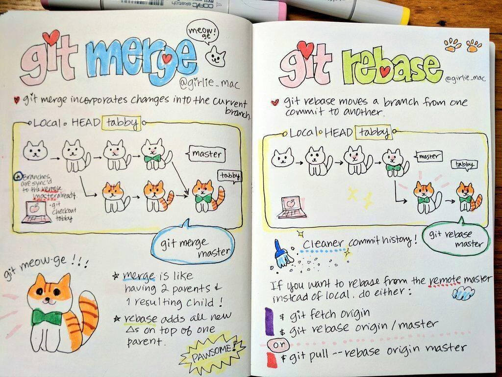

## Resolve conflicts



Key ideas:
- rebase === batch cherry-picks
- if you git conflicts, then you will need to resolve them any case
- `git rebase -i master|branch-name` helps have clean git history

### Conflict example

1. Let's create branch with git conflict at this repository. @TODO: Steps.
2. Try merge and rebase.

### Setup WebStorm as mergetool

1. Check that you have `webstorm` at terminal. If not run `Tools > Command-line Launcher`
2. Open the `~/.gitconfig` file with your favorite editor
3. Add these lines somewhere in the config:
```
[merge]
  tool = webstorm
[difftool "webstorm"]
  cmd = webstorm diff $(cd $(dirname "$LOCAL") && pwd)/$(basename "$LOCAL") $(cd $(dirname "$REMOTE") && pwd)/$(basename "$REMOTE")
[mergetool "webstorm"]
  cmd = webstorm merge $(cd $(dirname "$LOCAL") && pwd)/$(basename "$LOCAL") $(cd $(dirname "$REMOTE") && pwd)/$(basename "$REMOTE") $(cd $(dirname "$BASE") && pwd)/$(basename "$BASE") $(cd $(dirname "$MERGED") && pwd)/$(basename "$MERGED")
  trustExitCode = true
```

### Setup VSCode as mergetool
```
[merge]
    tool = vscode
[mergetool "vscode"]
    cmd = code --wait $MERGED
[diff]
    tool = vscode
[difftool "vscode"]
    cmd = code --wait --diff $LOCAL $REMOTE
```
4. Check with `git mergetool` command.
