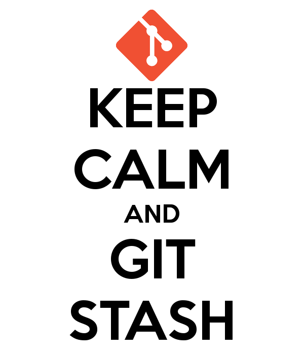

## Stash

Sometimes one needs to store away all modifications and go back to a clean state, but keep the modifications accessible. This is done using the stash.




### Stash essential

1. Make a change and stash it
```bash
echo Hello World! > stashing.txt
git add stashing.txt
git stash
```

2. Check a list of stashed changes
```bash
git stash list
```

3. Get it back
```bash
git stash apply
```

### Self research

<details>
<summary>Create stash with a custom message.</summary>
<code style="white-space:nowrap;">`git stash save DESCRIPTION`</code>
</details>

<details>
<summary>Stashing only the changes that have not been git added yet.</summary>
<code style="white-space:nowrap;">`git stash -k`</code>
</details>

<details>
<summary>What the different between `git stash pop` vs `git stash apply`.</summary>
<code style="white-space:nowrap;">pop removes the stash, apply doesn't</code>
</details>

JFYI: the stash is a special pseudo-branch, living in refs/stash. Their history is in the reflog.
